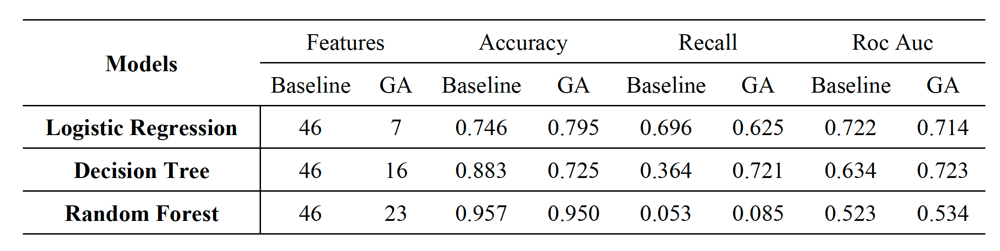
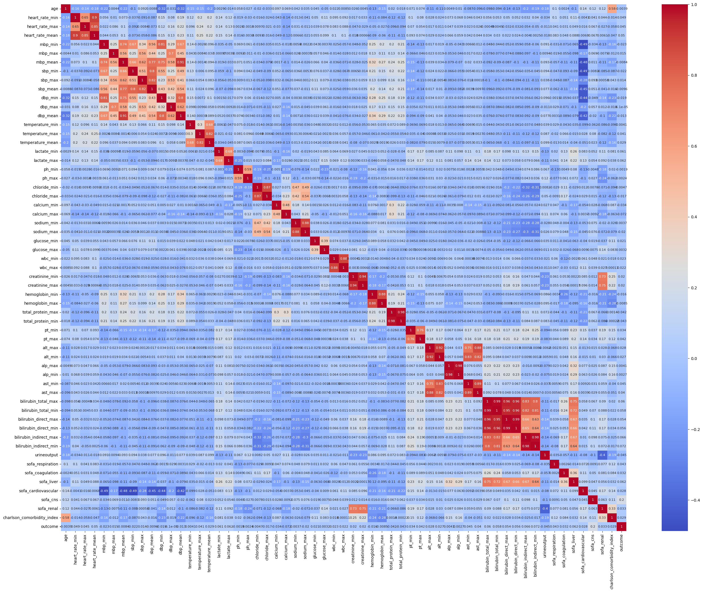
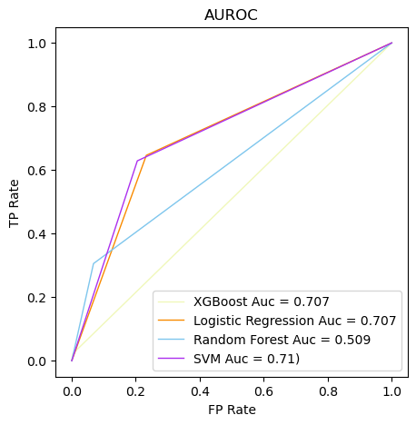
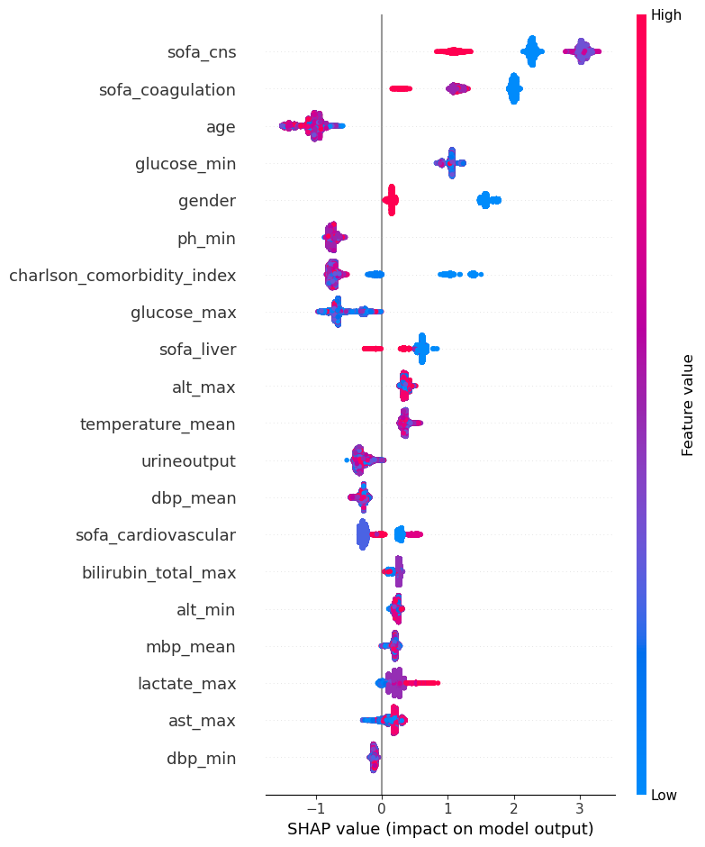

# SPH6004

### 1. [Assignment 1](https://github.com/JoyMei/SPH6004/tree/main/Assessment_1) ✨

> 🌱 For more detail about GA, please go to👉🏻 [Detail Parts](https://github.com/JoyMei/SPH6004/tree/main/Assessment_1/Detail%20Parts)

#### Models:

- [x] Logistic Regression
- [x] Decision Tree Classifier
- [x] Random Forest Classifier
- [x] XGBoost Classifier
- [x] SVM
- [x] Adaboost

#### Feature Selection:

Genetic Algorithm (GA) 

#### Data Visualization:

##### Heat map of data

##### AUROC of models

##### Feature value of XGBoost 

