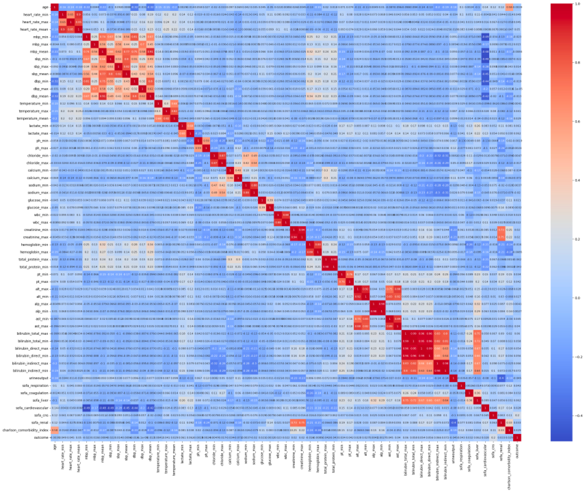

# SPH6004 Assignments 1 Detail Parts

## Part 1 🌱

### Explore Data Analysis (EDA)

## Part 2 🌿

### Feature Engineering 

Genetic Algorithm

- [x] Logistic Regression

- [x] Decision Tree Classifier

- [x] Random Forest Classifier

- [x] XGBoost Classifier

  

## Part 3 🪴
